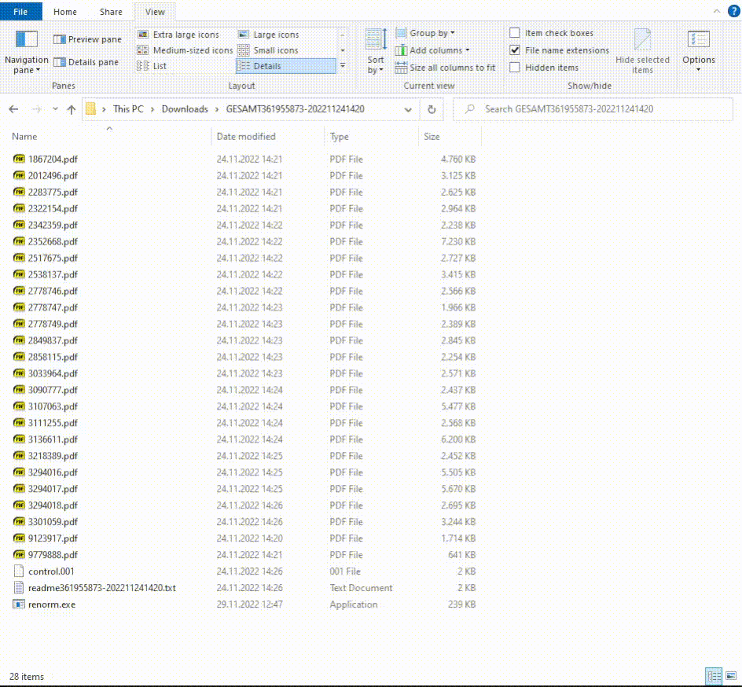

Bulk rename pdf files from Beuth publishing house

# ReNorm
## Renames Norm files from Beuth publishing house

If you buy many standards from Beuth Verlag, you can download them all together.
You will then receive a zip file with many PDF's. Unfortunately, the PDF files are named with the internal Beuth number.
Fortunately, this zip file also contains a 'readme....txt'. The readme is encoded in CSV format. This can be used to replace the Beuth numbers in the file name with the designation of the standard.

# Installation

Just grab the latest [release](https://github.com/smuel-adm/renorm/releases) zip from Github. Extract the .exe file and use it. You can also save the program in a folder listed in your PATH.

# Usage

This application needs one parameter, the readme file from the exported zip file.

## Pro tip

You can also just drag and drop the readme onto the executable.
It doesn't matter where the executable is located. In the following example
the exe is stored into the extracted zip folder. But you can also store the exe
somewhere else, e.g. onto your Desktop, bin folder or a temp dir.

# License

**GPL-3.0-or-later**
